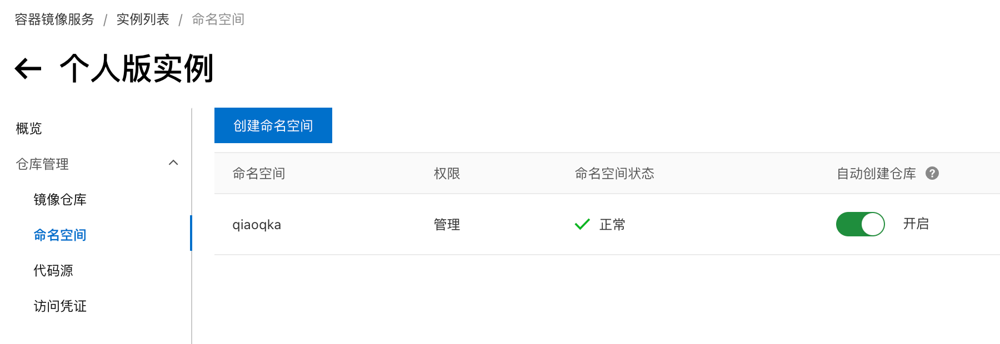
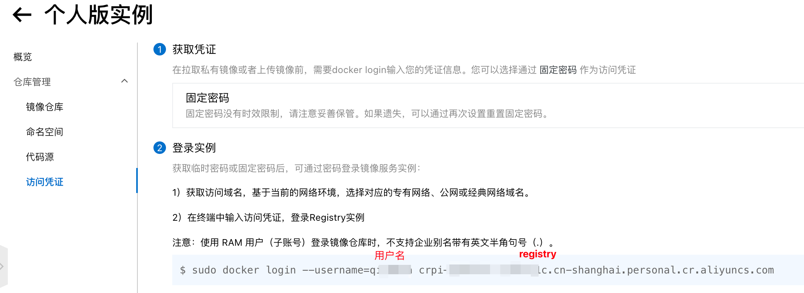
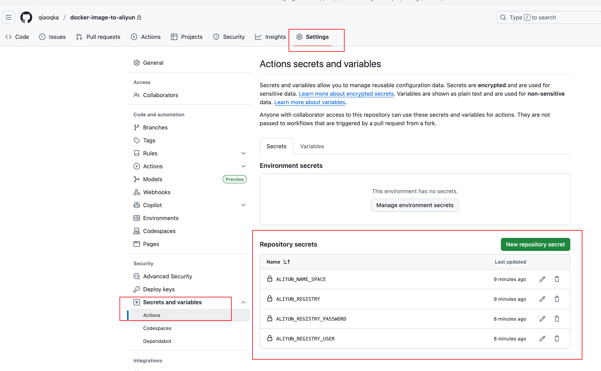
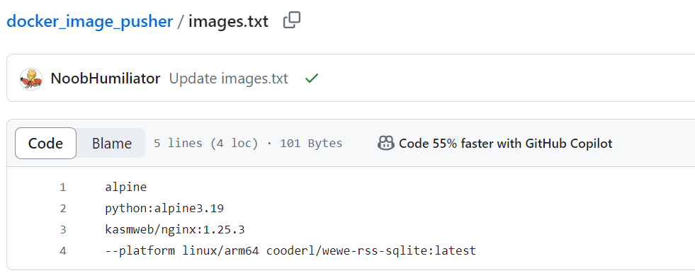
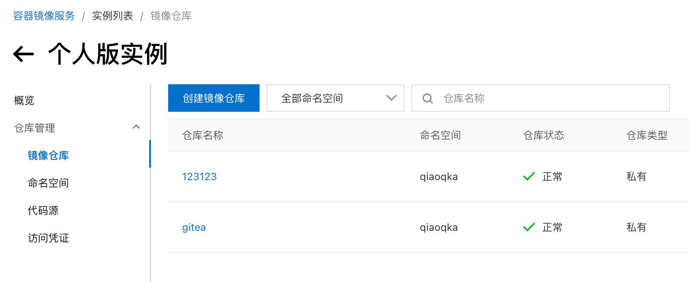

# 项目介绍

利用GitHub Actions自动化构建并推送Docker Image到阿里云容器镜像服务。

## 使用方式

### 配置阿里云

登录阿里云容器镜像服务

https://cr.console.aliyun.com/

启用个人实例，创建一个命名空间（**ALIYUN_NAME_SPACE**）



访问凭证–>获取环境变量  
用户名（**ALIYUN_REGISTRY_USER**）  
密码（**ALIYUN_REGISTRY_PASSWORD**）  
仓库地址（**ALIYUN_REGISTRY**）  



密码在刚创建个人实例时会提示创建，请自行保管

### Fork本项目

Fork本项目  
进入您自己的项目，点击Action，启用Github Action功能
配置环境变量，进入Settings->Secret and variables->Actions->New Repository secret

将上一步的 ALIYUN_NAME_SPACE，ALIYUN_REGISTRY_USER，ALIYUN_REGISTRY_PASSWORD，ALIYUN_REGISTRY
的值配置成环境变量

### 添加镜像

打开images.txt文件，添加你想要的镜像，可以带tag，也可以不用(默认latest)  
也可添加--platform xxxxx 或 --platform=xxxxx 参数指定镜像架构  

文件提交后，自动进入Github Action构建

### 使用镜像

回到阿里云，镜像仓库，点击任意镜像，可查看镜像状态。(可以改成公开，拉取镜像免登录)


在国内服务器pull镜像：  

``` sh
docker pull crpi-xx.cn-shanghai.personal.cr.aliyuncs.com/{自己的命名空间}/alpine
```

> 其中crpi-xx.cn-shanghai.personal.cr.aliyuncs.com 即 ALIYUN_REGISTRY  
> alpine 即images.txt里面填的镜像
  