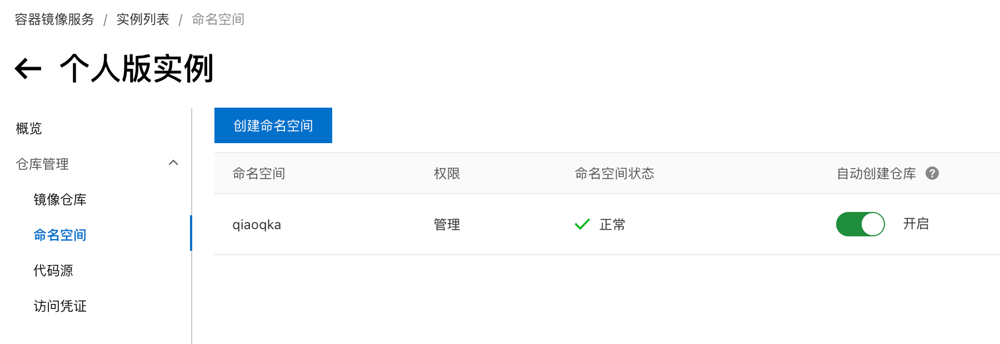
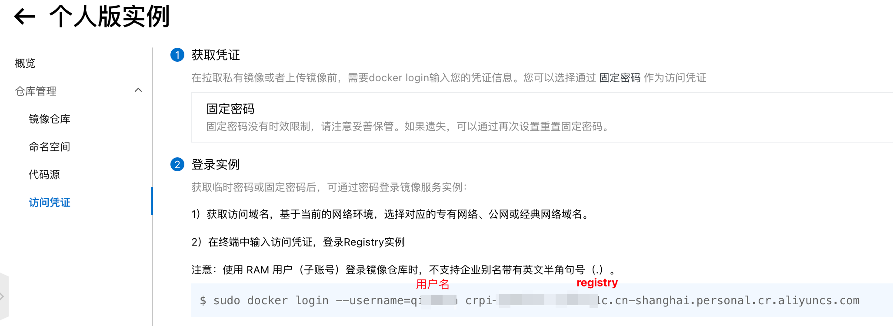
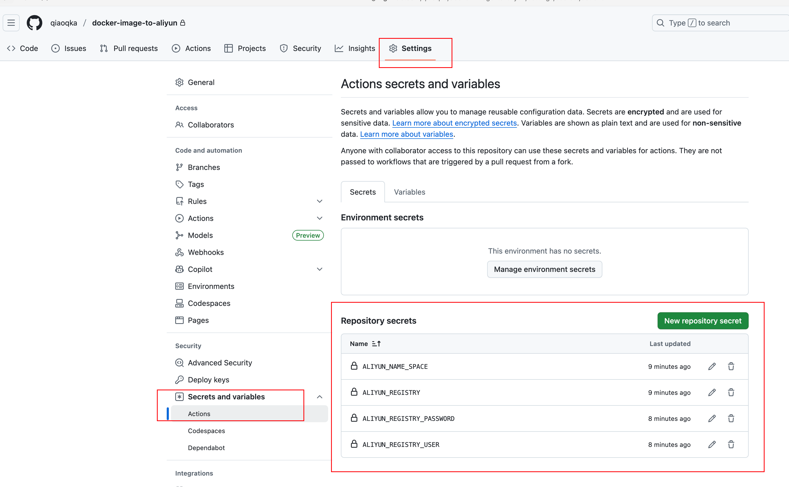

# 项目介绍

利用GitHub Actions自动化构建并推送Docker Image到阿里云容器镜像服务。

## 使用方式

### 配置阿里云

登录阿里云容器镜像服务

https://cr.console.aliyun.com/

启用个人实例，创建一个命名空间（**ALIYUN_NAME_SPACE**）



访问凭证–>获取环境变量  
用户名（**ALIYUN_REGISTRY_USER**）  
密码（**ALIYUN_REGISTRY_PASSWORD**）  
仓库地址（**ALIYUN_REGISTRY**）  



密码在刚创建个人实例时会提示创建，请自行保管

### Fork本项目

Fork本项目  
进入您自己的项目，点击Action，启用Github Action功能
配置环境变量，进入Settings->Secret and variables->Actions->New Repository secret

将上一步的 ALIYUN_NAME_SPACE，ALIYUN_REGISTRY_USER，ALIYUN_REGISTRY_PASSWORD，ALIYUN_REGISTRY
的值配置成环境变量

### 添加镜像

镜像清单是仓库根目录的 `images.yaml`。每条至少写 `source`，可选 `platform` 与 `local`：

```yaml
images:
  - source: alpine
  - source: oven/bun:1.2.19-alpine
  - source: continuumio/miniconda3:24.9.2-0
    platform: [linux/arm64]
  - source: xiaoyaliu/alist
    platform: [linux/arm64, linux/arm/v7]
  - source: alpine/minio:RELEASE.2025-10-15T17-29-55Z
    local: minio/minio:latest
```

- `source`（必填）：上游镜像，可以带 tag；不写 tag 按 `latest` 处理。
- `platform`（可选）：架构字符串列表，例如 `[linux/arm64]`、`[linux/arm64, linux/arm/v7]`。省略时按 `linux/amd64` 处理，阿里云 tag 不带架构后缀；显式指定会在阿里云 tag 后加 `-linux-arm64` 这类后缀。列表按顺序逐项展开成多条，单架构也要写成单元素列表；同一镜像多架构合并到一个列表即可，不要重复写多条同 source 条目。
- `local`（可选）：镜像拉到目标机后额外打的本地 tag。Action 不使用该字段，`运维脚本/ssh-docker-pull` 拉取脚本使用。多个架构展开时该值应用到每一条。

修改 `images.yaml` 并 push 到 `main` 即触发同步；也可以在 Actions 页面手动 Run workflow。

自动触发只监听 `images.yaml`、`.github/workflows/docker.yml`、`scripts/**` 的变更。同步串行处理全清单：逐条比对源与阿里云的 `config.digest`，相同就跳过，不同或无法确定才拉取并推送；任意一条失败都会让本次运行变红。

### 使用镜像

个人实例的镜像仓库默认私有，pull 前必须 `docker login` 登录，不建议把仓库改成公开。

在国内服务器pull镜像：

``` sh
docker login crpi-xx.cn-shanghai.personal.cr.aliyuncs.com
docker pull crpi-xx.cn-shanghai.personal.cr.aliyuncs.com/{自己的命名空间}/alpine
```

> 其中crpi-xx.cn-shanghai.personal.cr.aliyuncs.com 即 ALIYUN_REGISTRY  
> alpine 即 images.yaml 里面填的镜像
